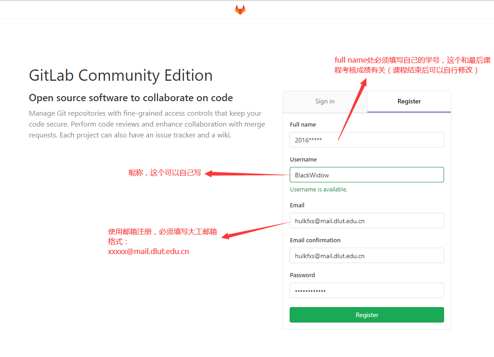
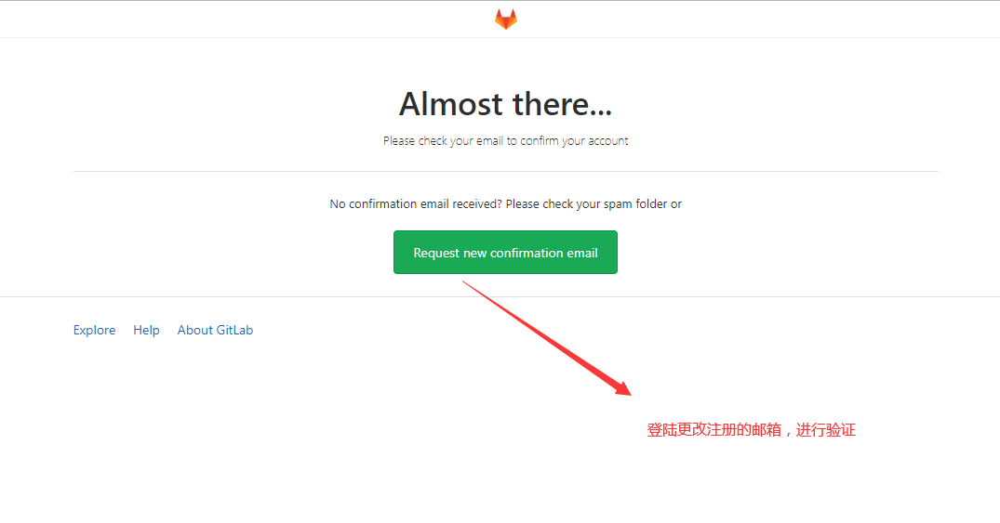
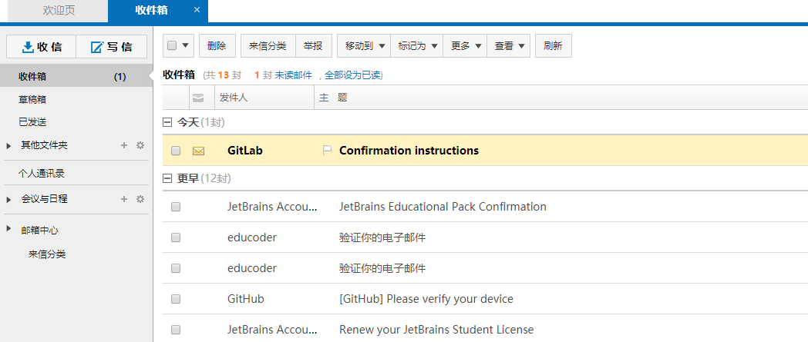
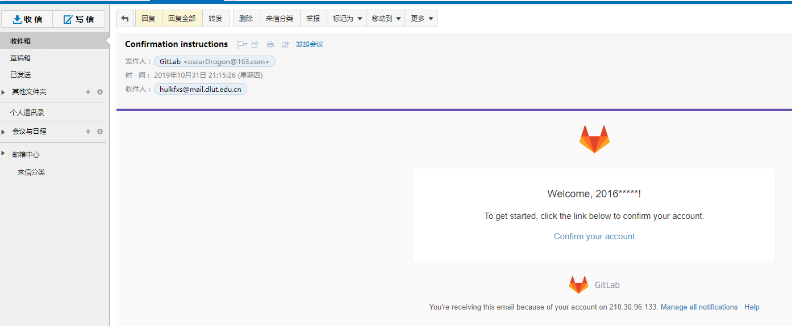
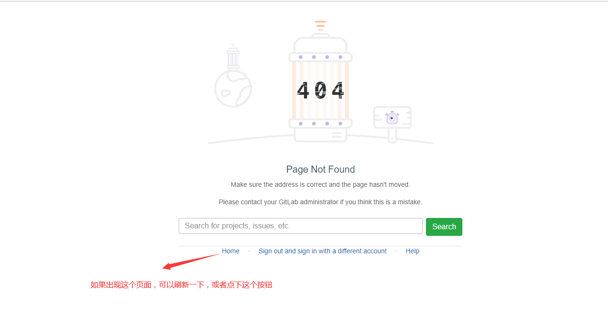
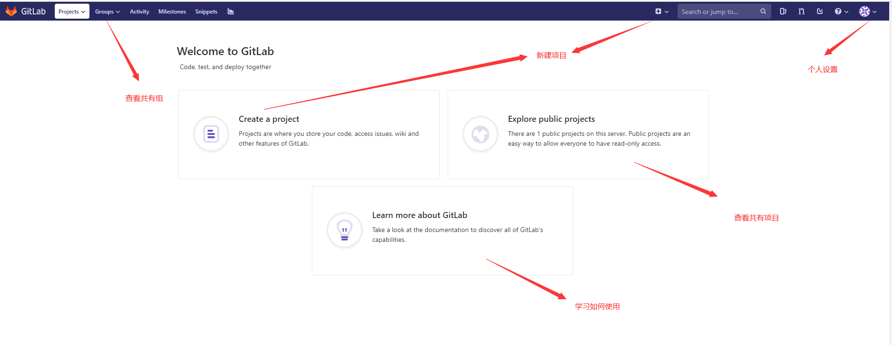
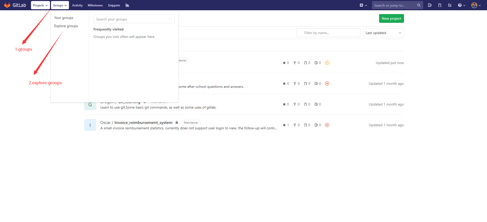
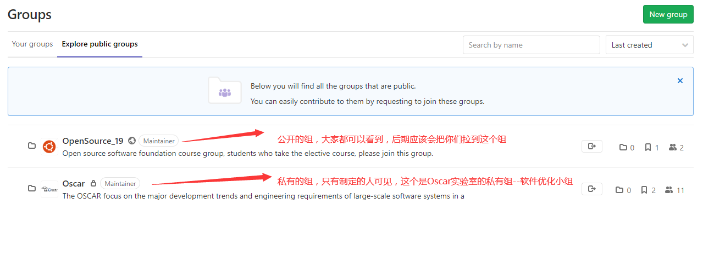
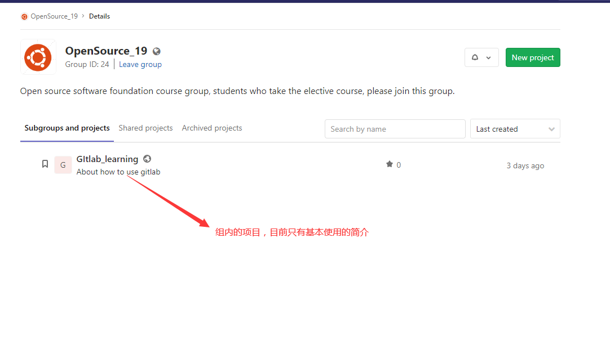
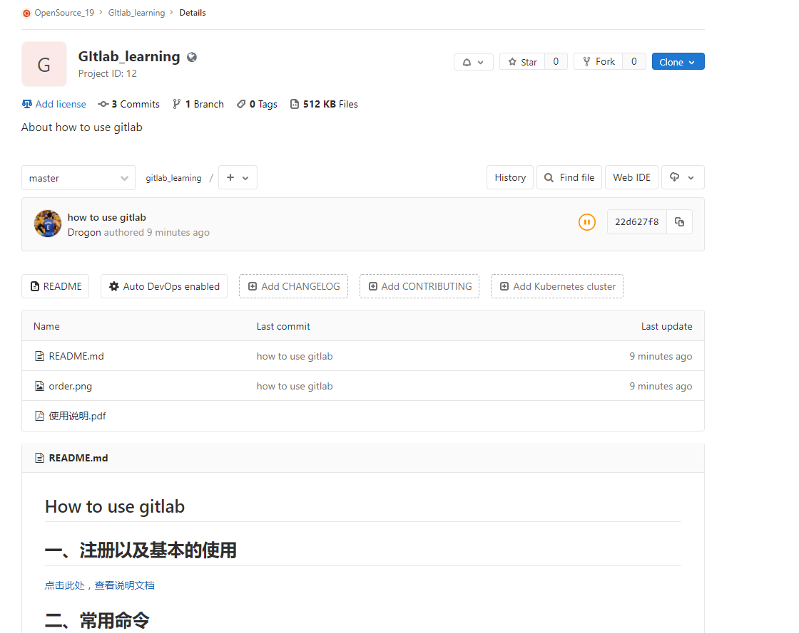

# gitlab使用说明

## 用户注册

[注册链接](http://210.30.96.133:8888/),http://210.30.96.133:8888/

一定要使用校园的大工邮箱注册使用，其他邮箱是不可以注册的，Full name需要设置为学号

之后登陆邮箱，确认验证

如果出现错误页，重新登陆一下就可以了

## 使用说明

登陆后，主界面如下：

## 查看组织

在左上角点击groups查看所有组织

组织分为共有组织和私有组织，大家应该可以看到OpenSource_19 

点进去后有个项目，GItlab_learning

查看项目，项目中有基本简介，在README.md中，有一些基本的常用命令，后续会继续完善

**之后就可以开始happy的使用了**